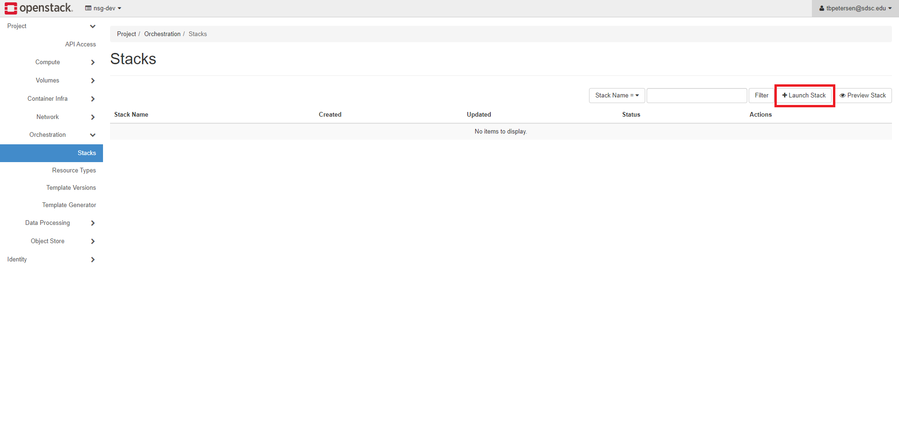
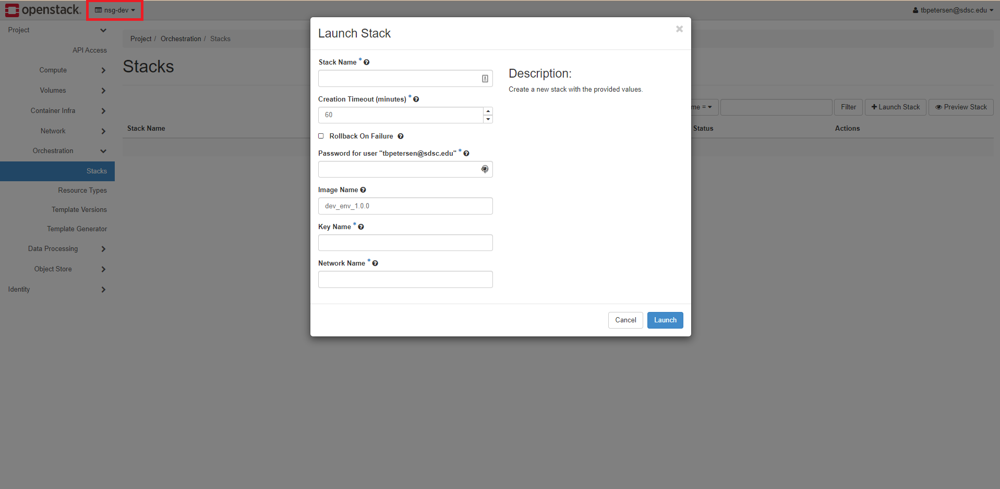

# Prerequisites
This guide will show you how to set up a two node cluster that is configured to
run OpenMPI. Before following this guide, make sure that you have [set up an
SSH key](https://sdsc-ucsd.atlassian.net/wiki/spaces/SC/pages/110034977/Getting+Started+with+Linux+Instances#GettingStartedwithLinuxInstances-ssh-keyCreateanSSHKey).

# Setting up an MPI Cluster

1. Log in to the [SDSC Cloud](https://dashboard.cloud.sdsc.edu/).
2. Navigate to **Project -> Orchestration -> Stacks** using the menu on the
left.


3. Click **Launch Stack** on the upper right of the screen.


4. Change **Template Source** to URL and paste the following URL into
**Template URL**:

```
https://raw.githubusercontent.com/sdsc/nsg-developer-env/master/guides/public/mpi_cluster/res/cluster-template.yaml
```

5. Click **Next**.

6. Fill out the form that shows up:
* **Stack Name** - whatever you would like to name your cluster
* **Password for [username]** - your openstack password
* **Image Name** - the name of the image that you would like to use for
all nodes in the cluster (This image must have the MPI software stack installed
on it. If unsure, use the default. )
* **Key Name** - the name of the SSH key that you would like to use to access
nodes in the cluster
* **Network Name** - should be "[project name]s_network" where your replace 
[project name] with the name of your project. This value should be in the upper
left corner.

For example, the project name here is "nsg-dev"

7. Click **Launch**. The stack will create two compute instances called
"nsg-node-1" and "nsg-node-2". You can connect to these nodes via ssh using
the ssh key specified earlier. The IPs for these instances can be found on the
**Instances** page.
Use whatever username is default for the image
that you specified earlier. If you specified an nsg-dev image, then the user
should be "ubuntu".

**Note: Clusters should only stay up for as long as they are needed. When they
are not needed, be sure to destroy them or [shelve the nodes](https://sdsc-ucsd.atlassian.net/wiki/spaces/SC/pages/348585987/Shelving+an+Instance+to+Minimize+Resource+Usage+Charges).**

# Destroying an MPI Cluster
1. Log in to the [SDSC Cloud](https://dashboard.cloud.sdsc.edu/)
2. Navigate to **Project -> Orchestration -> Stacks** using the menu on the
left.


3. Select the check mark for the stack that you would like to destroy. Then
click **Delete Stacks** in the upper right. 